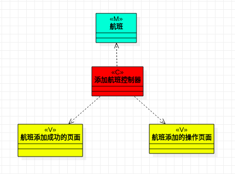
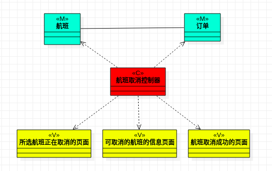

# 实验4&5名称：类建模&高级类建模

## 一、实验目标

#### 1. 掌握类建模的方法；
#### 2. 了解MVC设计模式；
#### 3. 理解类的5种关系；
#### 4. 掌握类图的画法；
#### 5. 掌握类之间关系的画法。

## 二、实验内容

#### 1. 记录类的知识；
#### 2. 找出具体的类；
#### 3. 画类图。

## 三、实验步骤

#### 1. 观看录制视频、学习课堂文档：
1.1 学习来源：
- [实验四要求](https://github.com/hzuapps/uml-modeling-2020/issues/4)
- [实验五要求](https://github.com/hzuapps/uml-modeling-2020/issues/5)
- [实验45相关的录制视频](https://space.bilibili.com/44472532/ )
- [百度MVC设计模式](https://baike.baidu.com/item/MVC%E6%A1%86%E6%9E%B6/9241230?fromtitle=MVC%E8%AE%BE%E8%AE%A1%E6%A8%A1%E5%BC%8F&fromid=8160955&fr=aladdin)
- [UML类图](https://www.jianshu.com/p/57620b762160)

1.2 学习笔记：

1.2.1 视图角度：
- 用例图：做什么？；活动图：怎么做？；类图：谁做？
- 逻辑视图：类和高级类。

1.2.2 类的基本概念：
- 类的概念（实体与对象）。
- 类的构成及画法（类名、可见性(+、#、~、-)、操作和属性等）。

1.2.3 类之间的关系：依赖（虚线箭头）、关联（实线）、聚合（实线白色菱形箭头）、组合（实线黑色菱形箭头）、继承（实线白三角形）。
- 依赖：对于两个相对独立的对象，当一个对象负责构造另一个对象的实例，或者依赖另一个对象的服务时，这两个对象之间主要体现为依赖关系。
- 关联：对于两个相对独立的对象，当一个对象的实例与另一个对象的一些特定实例存在固定的对应关系时，这两个对象之间为关联关系。
- 聚合：表示一种弱的‘拥有’关系，即has-a的关系，体现的是A对象可以包含B对象，但B对象不是A对象的一部分。 两个对象具有各自的生命周期。
- 组合：组合是一种强的‘拥有’关系，是一种contains-a的关系，体现了严格的部分和整体关系，部分和整体的生命周期一样。
- 继承：继承表示是一个类（称为子类、子接口）继承另外的一个类（称为父类、父接口）的功能，并可以增加它自己的新功能的能力。

1.2.4 MVC设计模式：
- MVC：Model(业务数据)、View(界面)、Controller(功能+控制器)；C可控制M和V，M和V隔绝。
- Model:模型、实体和**业务数据**；
- View：视图、**界面**和AbcUI。
- Controller：控制器、**系统**、Controller和Service。

#### 2. 确定具体的类：

2.1 添加航班：
- Model(主要根据数据业务寻找)：航班；
- View(主要根据“页面”关键字寻找)：航班添加成功页面和添加航班操作页面；
- Controller(功能+控制器):航班添加控制器。

2.2 取消航班：
- Model(主要根据数据业务寻找)：航班A和订单B，B关联于A；
- View(主要根据“页面”关键字寻找)：所选航班正在取消的页面、可取消的航班的信息页面和航班取消成功的页面；
- Controller(功能+控制器):航班取消控制器。

#### 3. 画类图步骤如下：

3.1 根据确定的具体的类，给类命名；

3.2 根据类的类型(M/V/C)，给类标注；

3.3 根据Model间的关系强弱，选择关系对应的线的类型，进行连线。

## 四、实验结果

#### 1. 类图1：添加航班

#### 2. 类图2：取消航班

## 五、实验总结

#### 1. MVC设计模式是一种软件设计典范，用一种业务逻辑、数据、界面显示分离的方法组织代码，将业务逻辑聚集到一个部件里面，在改进和个性化定制界面及用户交互的同时，不需要重新编写业务逻辑。

#### 2. 本次类图的画法为： 先根据Model（业务数据）、View（页面）和Controller（功能+控制器）找出具体的类，标注好类型（M/V/C），确定类之间的关系，如果有箭头，注意箭头指向。

