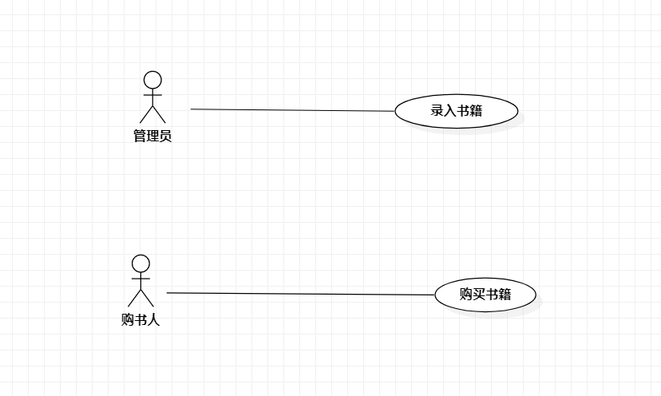

# 实验二：用例建模

## 一、实验内容

1. 细化功能需求。
2. 画出用例图（Use Case Diagram）。
3. 编写用例规约（表格）。

## 二、实验要求

1. 给每一个功能点写一段描述（字数至少60字，3行）。
2. 写清楚使用功能的用户。
3. 说明该功能执行之后产生的结果。
4. 用例规约必填：基本流程（成功执行用例的步骤）；扩展流程（引起用例失败的步骤）。

## 三、实验步骤

1. 确定二手书籍交易系统功能并描述
   - 录入书籍信息：管理员从售书人中获取书籍，成功登录后，点击“录入书籍信息”按钮，将“出售人账号”“出售人姓名”，“出售价格”，“ISDN码”，“作者”，“出版社”信息分别填入相应的文本框中，点击“确定”按钮进行上传，管理员保留书籍。
   - 购买书籍：购书人在登录成功后，直接进入系统主页面，主页面展示出售的书籍，确认要购买的书籍点击“购买”按钮，进入付款页面，点击“确认付款”，付款成功后显示订单码，购书人姓名和出售人姓名，并显示“截图保存”的文字，通过截图向管理员取书。
2. 确定使用者
   - 管理员
   - 购书人
3. 创建usecase（录入书籍信息，购买书籍）分别于Actor（管理员，购书人）连接
4. 导出用例图。

## 四、实验结果

### 用例图

  

### 用例规约的编写

1. 表1：录入书籍信息用例规约

   + | 用例编号 | UC01                                            | 备注                 |
     | -------- | :---------------------------------------------- | -------------------- |
     | 用例名称 | 录入书籍                                           |                      |
     | 前置条件 | 管理员登录系统                              | *可选*               |
     | 后置条件 |                                                 | *可选*               |
     | 基本流程 | 1. 管理员点击录入书籍信息                        | *用例执行成功的步骤* |
     | ~        | 2. 系统进入添加书籍页面                        |                      |
     | ~        | 3. 管理员进行填写，点击“确定”按钮              |                      |
     | ~        | 4. 系统判断书籍信息填写完成             |                      |
     | ~        | 5. 系统生成本书的序号，保存序号和书籍信息      |                      |
     | ~        | 6. 系统显示提交完成文本框      |                      |
     | 扩展流程 | 3.1 管理员点击“取消”按钮，结束用例 | *用例执行失败*       |
     | ~        | 4.1 管理员书籍信息未全部填写完全，显示未完成信息填写，返回填写                     |

2. 表2：购买书籍用例规约

   + | 用例编号 | UC02                              | 备注                 |
     | -------- | :-------------------------------- | -------------------- |
     | 用例名称 | 购买书籍                             |                      |
     | 前置条件 | 购书人登录系统                | *可选*               |
     | ~         | 系统有可销售书籍，进入购书页面                |              |
     | 后置条件 |                                   | *可选*               |
     | 基本流程 | 1. 选择书籍购买，点击“购买”按钮，进入付款页面   | *用例执行成功的步骤* |
     | ~        | 2. 用户付款，点击付款按钮        |                      |
     | ~        | 3. 确认用户已付款，系统生成订单   |
     | ~        | 4. 显示"订单码"，"购书人姓名"和"出售人姓名"的订单信息，并显示“截图保存”的文字     |      |
     | 扩展流程 | 1.1 用户没有想购买的书籍，选择退出，结束用例   | *用例执行失败*       |
     | ~        | 2.1 购书人点击“取消付款”按钮，结束用例 |
