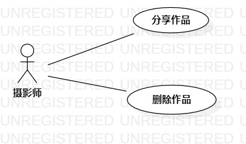

# 实验二：用例建模

## 1.实验目标

1. 学会使用Markdown编写实验报告 
2. 掌握用例的概念和用例建模

## 2.实验内容

1. 提交个人选题到Issues 
2. 用StartUML完成用例建模 
3. 用Markdown完成实验报告

## 3.实验步骤

1. 确定issues：**摄影作品分享系统**，功能如下：

   - 摄影师分享作品

   - 摄影师删除已分享作品

2. 提交issues，使用StarUML画出相关用例图：

   - 创建“摄影师“这个参与者

   - 创建两个用例

   - 建立关系Association

3. 编写用例规约

4. 提交用例图和实验报告到github
## 4.实验结果

### 4.1用例图

图一：“摄影作品分享系统”用例图

### 4.2用例规约

作品存放在服务器文件系统，作品信息存放在服务器的数据库。

#### 表1：分享作品用例规约

| 用例编号 | UC01                                                         | 备注                   |
| -------- | ------------------------------------------------------------ | ---------------------- |
| 用例名称 | 分享作品                                               |                        |
| 前置条件 | 摄影师登录到后台系统                                         |                        |
| 后置条件 | 摄影师进入作品详情页面                                     | 显示所有图片和图片信息 |
| 基本流程 | 1.摄影师点击分享作品按钮；                              | 成功                   |
| ~        | 2. 系统显示本地电脑的选择图片窗口；                            |                        |
| ~        | 3. 摄影师确定作品，点击分享按钮；                            | 可以多选作品或在期间取消勾选作品 |
| ~        | 4. 系统检查作品信息不为空、作品个数大于零、和作品格式正确； | 格式：png、jpg、jpeg   |
| ~        | 5. 系统保存作品并获取作品地址，保存作品信息（id，分类、图片地址url），提示“分享成功”。 |                        |
| 扩展流程 | 4.1 系统检查作品个数大于零且作品信息为空，提示“作品信息不为空”；     | 失败                   |
| ~        | 4.2 系统检查作品个数等于零，提示“作品至少1个”；              | 失败                   |
| ~        | 4.3 系统检查作品个数大于零和作品格式不正确，提示“作品格式错误”。 | 失败                   |

#### 表2：删除已分享作品用例规约

| 用例编号 | UC02                                                         | 备注     |
| -------- | ------------------------------------------------------------ | -------- |
| 用例名称 | 删除已分享作品                                                 |          |
| 前置条件 | 摄影师登录到后台系统                                         |          |
| 后置条件 |                                                              |          |
| 基本流程 | 1. 摄影师点击查看作品按钮；                              | 成功     |
| ~        | 2. 系统显示作品详情页面，加载所有作品和作品信息；          |      成功 |
| ~        | 3.摄影师选中作品的删除按钮；                        |     可同时选中多个作品的删除按钮     |
| ~        | 4. 系统提示“是否删除作品”；            |         |
| ~        | 5. 摄影师点击确认删除按钮；            |   成功    |
| ~        | 6. 系统通过作品地址删除作品，删除作品信息，提示“作品已删除”。 |          |
| 扩展流程 |
 | ~        |6.1 系统检查作品信息不存在，提示“作品数据不存在”；           | 失败     |
| ~        | 6.2 系统检查作品信息存在，获取作品地址不存在，删除作品信息。提示“作品数据已删除”。 | 成功     |

