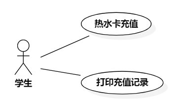

# 实验二 用例建模

## 一、实验目标
1. 使用Markdown编写实验报告
2. 选择个人建模选题
3. 学习UML及用例建模基本概念

## 二、实验内容
1. 提交个人建模选题到Issues
2. 使用Markdown完成实验报告
3. 用StartUML完成用例建模

## 三、实验步骤
1. 在Issues上提交个人选题"校园热水卡管理系统"及其相关功能。
- 功能1：热水卡充值
- 功能2：打印充值记录

2. 根据选题和功能使用StartUML创建用例图
- 确定参与者(Actor):
  + 学生
- 确定三个用例(UserCase)：
  + 热水卡充值
  + 打印充值记录
- 建立参与者(Actor)与用例(UserCase)之间的关系(Association)

3. 编写用例规约

## 四、实验结果

图1："校园热水卡管理系统"用例图
### 表1：热水卡充值用例规约
用例编号 | UC01                                                         
---------|--------------------------------------------------------------
用例名称 | 热水卡充值                                                   
前置条件 | 学生进入充值界面                                             
基本流程 | 1.学生选择充值额度[可选10元(默认)、20元、50元、100元]        
   ~     | 2.学生点击确认按钮                                           
   ~     | 3.系统检查学生账号余额，保存充值记录，并显示"**充值成功**"   
扩展流程 |3.1系统发现学生账号余额不足，显示"**账号余额不足，充值失败**" 

### 表2：打印充值记录用例规约
用例编号 | UC02                                                         
---------|--------------------------------------------------------------
用例名称 | 打印充值记录                                                 
前置条件 | 学生已登录系统                                               
基本流程 | 1.学生点击"充值记录"按钮                                     
   ~     | 2.系统检查学生的热水卡充值记录并显示                     
扩展流程 | 2.1系统发现学生的热水卡充值记录为空，显示"**记录为空**"  
