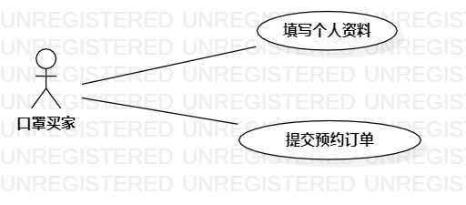

# 实验二

## 一、实验目标

1. 熟悉用Markdown文件编写实验报告；
2. 熟悉用StarUML绘制用例图；
3. 掌握用例规约的编写。

## 二、实验内容

1. 细化选题功能；
2. 使用StarUML绘制用例图；
3. 编写用例规约表格；
4. 编写实验报告。

## 三、实验步骤

1. 细化选题功能：
   - 改“用户”为“口罩买家”；
   - 删除“保存数据库”等啰嗦语句；
   - 删除查询功能。
2. 在StarUML绘制用例图：
   - 打开StarUML，在Model文件夹右键，选择“Add Diagram”，新建“Use Case Diagram”；
   - 创建一个名为“口罩买家”的参与者；
   - 创建两个功能用例，分别为“填写个人资料”和“提交预约订单”；
   - 连接“口罩买家”和两个功能用例。
3. 编写用例规约表格。

## 四、实验结果

    

图1 ：口罩预约小程序的用例图

#### 表1：填写个人资料用例规约

| 用例编号 | UC001                                          |
| -------- | ---------------------------------------------- |
| 用例名称 | 填写个人资料                                   |
| 前置条件 | 系统获取口罩买家授权的微信openId               |
| 后置条件 | 系统跳转回小程序首页                           |
| 基本流程 | 1.口罩买家点击填写个人资料链接；               |
| ~        | 2.系统显示个人资料页面；                       |
| ~        | 3.口罩买家输入个人资料，点击提交按钮；         |
| ~        | 4.系统检查填写格式正确，保存个人资料；         |
| ~        | 5.系统提示“提交成功”。                         |
| 扩展流程 | 4.1 系统检查填写格式有误，提示“格式填写有误”。 |

#### 表2：提交预约订单用例规约

| 用例编号 | UC002                                                        |
| -------- | ------------------------------------------------------------ |
| 用例名称 | 提交预约订单                                                 |
| 前置条件 | 口罩买家已提交个人资料                                       |
| 后置条件 | 系统显示订单页面                                             |
| 基本流程 | 1.口罩买家点击口罩预约链接；                                 |
| ~        | 2.系统显示口罩预约页面；                                     |
| ~        | 3.口罩买家选择预约数量和预约门店，点击预约按钮；             |
| ~        | 4.系统检查预约数量不大于2包，并且预约门店有存货；            |
| ~        | 5.系统获取口罩买家个人资料，保存预约订单，同时减去预约门店的口罩存货数量； |
| ~        | 6.系统提示“预约成功”。                                       |
| 扩展流程 | 4.1 系统检查预约数量大于2包，提示"口罩数量每人仅限2包"；     |
| ~        | 4.2 系统检查预约门店存货数量小于预约数量，提示“所选门店口罩存货不足”。 |

