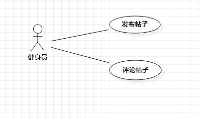

# 实验二：用例建模
## 一、实验目标
1.熟练运用GitHub的功能编写提交实验报告  
2.学会用StarUML画出系统用例图  
3.加深自己对于用例的理解和掌握
## 二、实验内容
1.运用StarUML对自己选定的系统进行用例建模  
2.在GitHub上编写这次的实验报告  
3.提交自己的实验报告
## 三、实验步骤
1.添加一个发布帖子的用例  
2.添加一个评论帖子的用例  
3.添加一个参与者：健身员  
4.最后把参与者与上述三个用例连接起来  
## 四、实验结果
  
图1：健身交流系统用例图

## 五、用例规约的编写

### 表1：发布帖子用例规约  
用例编号  | UC01 | 备注  
-|:-|-  
用例名称  | 发布帖子  |   
前置条件  |      | *可选*   
后置条件  | 帖子发布成功     | *可选*   
基本流程  | 1.健身员点击发布链接；  |*用例执行成功的步骤*    
~| 2.系统显示编写界面；  |   
~| 3.健身员输入文字、照片或者视频，点击发布按钮；   |   
~| 4.系统检查内容不为空，保存内容信息；   |   
~| 5.系统提示发布成功。   |  
扩展流程  | 4.1系统检查内容为空，提示发布失败。   |*用例执行失败*    
 
 
 
### 表2：评论帖子用例规约  
用例编号  | UC02 | 备注  
-|:-|-  
用例名称  | 评论帖子  |   
前置条件  | 进入浏览界面     | *可选*   
后置条件  | 帖子评论成功     | *可选*   
基本流程  | 1.健身员点击评论链接；  |*用例执行成功的步骤*    
~| 2.系统显示爱评论界面；  |   
~| 3.健身员输入内容，点击发送按钮；   | 
~| 4.系统检查要评论的帖子不为空；|
~| 5.系统检查内容不为空，保存内容信息；|   
~| 6.系统提示评论成功。  |  
扩展流程  | 4.1系统检查要评论的帖子为空，提示评论失败；   |*用例执行失败*
~| 5.1.系统检查评论内容为空，提示评论失败。  |   

