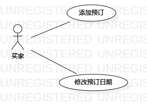

## 1. 实验目标
  1. 确立自己的选题
  2. 根据自己的选题,完成功能介绍
  3. 根据自己的题目画出该题目的用例图
  4. 完成用例规约

## 2. 实验内容
 1. 在issue里提交自己的选题和功能介绍
 2. 我的题目是#617 景点门票线上预约系统，功能是：
    1.添加预订
    2.修改预订日期 
 3. 根据自己的选题，找出参与者与用例，并画出用例图
 
## 3. 实验步骤
  1. 看选题，找出我的选题中的参与者：买家。
  2. 再根据选题的功能，写出两个用例： 
     1.添加预订
     2.修改预订日期
  3. 建立参与者与用例之间的联系（Association）
  4. 写出两个用例的用例规约，如下表表1、表2所示
  
## 4. 实验结果

 

图1：景点门票线上预约系统的用例图
 

##表1：添加预订用例规约

用例编号  | UC01 | 备注  
-|:-|-  
用例名称  | 添加预订  |   
前置条件  |    | *可选*   
后置条件  |  买家进入预订管理的界面  | *可选*   
基本流程 |1.买家点击预订按钮 |
~| 2. 系统进入到填写预订信息的界面 |
~| 3. 买家点击添加游客信息的按钮；  |*用例执行成功的步骤*    
~| 4. 系统显示编辑游客信息页面；  |   
~| 5. 买家编辑游客信息（姓名，省份证，参观日期，手机号等），点击确定按钮；  |   
~| 6. 系统检查游客信息，统计本订单游客的数目；  |   
~| 7. 买家点击提交订单按钮；  |
~| 8. 系统查询当天景点门票的剩余数目，检查该景点门票数目充足，减去相应的景点门票的数目；  |
~| 9. 系统保存预订信息；|
~| 10. 系统显示预订成功。  |
扩展流程  | 6.1 系统检查发现游客信息必填项为空，提示买家“必填项不能为空”；  |*用例执行失败*    
~| 8.1 系统检查发现当天景点门票的剩余数目不足，提示买家“该门票剩余的票数不足”；  |

##表2：修改预订日期用例规约

 用例编号  | UC02 | 备注  
-|:-|-  
用例名称  | 修改预订日期  |   
前置条件  |  买家预订成功  | *可选*   
后置条件  |  买家进入预订管理的界面  | *可选*   
基本流程  | 1. 买家点击修改预订的按钮；  |*用例执行成功的步骤*    
~| 2. 系统显示预订管理的界面；  |   
~| 3. 买家点击修改日期的按钮并且选择新的日期，然后点击确认的按钮；  |   
~| 4. 系统查询新日期的景点门票的剩余数目，检查该景点门票数目充足，减去相应的景点门票的数目；   |   
~| 5. 系统增加旧日期的景点门票的数目；|
~| 6. 系统显示修改成功。|
扩展流程  | 4.1 系统检查发现新日期的景点门票的剩余数目不足，提示买家“该门票剩余的票数不足，请重新选择新的日期”；  |*用例执行失败*  
