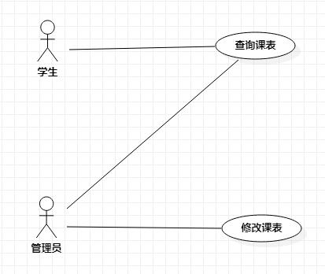

# 实验二

## 实验内容
## 一、实验目标

1. 使用Markdown编写实验报告
2. 学习使用StarUML建模
3. 细化主题

## 二、实验内容

1. 编写规范的实验文档
2. 画出选题功能需求用例图
3. 编写用例规约

## 三、实验步骤

1. 新建issues选题为课程系统
2. 在StarUML上创建用例图
3. 确认参与者（）：
  - 学生
  - 管理员
4. 确认用例（）：
  - 查询课表
  - 修改课表
5. 根据功能需求建立关系，画出用例图
6. 编写用例规约

## 四、实验结果

1. 画图

图1.课程系统的用例图

## 表1：查询课表用例规约  

用例编号  | UC01 | 备注  
-|:-|-  
用例名称  | 查询课表 |   
前置条件  |   参与者登录成功，进入课程系统  | *可选*   
后置条件  |   显示课表   | *可选*   
基本流程  | 1.参与者点击课程查询菜单  |*用例执行成功的步骤*    
~| 2.系统显示课程查询页面  | 
~| 3.参与者输入年级专业班级，点击查询  |   
~| 4. 系统检查输入格式无误，查询班级信息存在 |   
~| 5. 查询相应班级课表 |  
~| 6. 显示相应班级课表 |  
扩展流程  | 4.1 系统检查输入格式有误  |*用例执行失败*    
~| 4.2  系统查询班级信息不存在 |  

## 表2：修改课表用例规约  

用例编号  | UC02 | 备注  
-|:-|-  
用例名称  | 修改课表 |   
前置条件  |   管理员查询课表成功  | *可选*   
后置条件  |   显示修改后的课表   | *可选*   
基本流程  | 1.管理员点击需要修改的课程  |*用例执行成功的步骤* 
~| 2.系统验证管理员权限成功 |  
~| 3.系统匹配相应课程  | 
~| 4.管理员输入课程名，点击修改  |   
~| 5. 系统检查输入格式无误，保存修改课程，提示修改成功 |   
~| 6. 显示修改后的班级课表 |    
扩展流程  | 2.1 系统验证管理员权限失败 |*用例执行失败*    
 ~| 5.1 系统检查输入格式有误 |  
