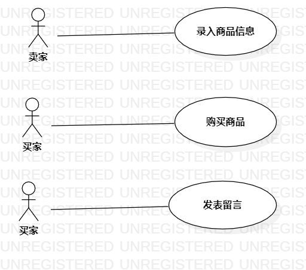

# 实验二

## 一、实验目标

&emsp;学习掌握用例建模知识

## 二、实验内容

1. UML建模选题
2. 绘制用例图
3. 编写用例规约

## 三、实验步骤

1. 建模选题为二手交易网站，确定功能需求
2. 根据选题功能绘制用例图
3. 确定用例：录入商品信息，购买商品，发表留言
4. 确定参与者：卖家，买家
5. 联系参与者和用例
6. 编写用例规约

## 四、实验结果

图1.二手交易平台用例图

## 表1：添加商品用例规约  

用例编号  | UC01 | 备注  
-|:-|-  
用例名称  | 添加商品 |   
前置条件  |卖家登录二手交易网站，点击出售按钮打开商品录入页面 |  
后置条件  |卖家进入对应商品类别的商品列表     |   
基本流程  | 1. 卖家输入商品信息  | 
~| 2. 卖家点击提交按钮  |   
~| 3. 系统检查必填信息填写完全，保存商品信息  |   
~| 4. 系统根据添加时间顺序显示对应商品类别的商品列表 |
扩展流程  | 3. 系统检查商品必填信息为空，提示"商品信息未填写完全"    |    

## 表2：购买商品用例规约  

用例编号  | UC02 | 备注  
-|:-|-  
用例名称  | 购买商品  |   
前置条件  | 买家登录二手交易网站，点击购买按钮打开订单支付页面   |
后置条件  | 系统显示订单完成页面   |   
基本流程  | 1. 买家检查或修改订单信息   |  
~| 2. 买家点击支付按钮 |   
~| 3. 系统检查收货信息完整，查询商品和买家信息，生成订单  |  
~| 4. 签名订单信息 |
~| 5. 系统保存订单信息 |   
~| 6. 系统更新商品数目 |
~| 7. 系统调用第三方支付接口，显示第三方支付窗口 |
~| 8. 买家在第三方支付窗口完成支付 |
~| 9. 系统查询返回结果为支付成功，保存支付状态|
~| 10. 系统显示订单完成页面  |
扩展流程  | 3. 系统检查收货信息不完整，提示"收货信息未填写完全"   |  
~| 9. 系统查询返回结果为支付失败，显示订单未支付页面 |

## 表3：留言商品用例规约  

用例编号  | UC03 | 备注  
-|:-|-  
用例名称  | 发表留言  |   
前置条件  | 买家登录二手交易网站，点击留言按钮打开留言页面   |
后置条件  | 保存留言，增加商品留言数   |   
基本流程  | 1. 买家输入留言   |  
~| 2. 买家点击发送按钮 |   
~| 3. 系统保存留言  |   
~| 4. 系统修改该商品的留言数 |   
~| 5. 系统刷新留言列表 |
扩展流程  | 3. 系统检测留言商品下架，提示"商品已下架" |  
