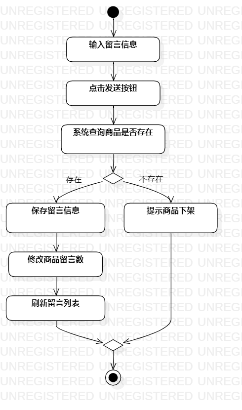

# 实验二

## 一、实验目标

1、掌握过程建模方法；  
2、掌握活动图的画法

## 二、实验内容

&emsp;根据用例规约完成活动图

## 三、实验步骤

1. 添加开始结点Initial
2. 绘制活动图具体流程
- 添加Action: Action表示用例实现过程中的具体操作，包括用户的行为和系统的行为，根据用例规约基本流程和扩展流程确定。
- 添加Decision：Decision开启一个分支，需在边界上注明分支条件
- 添加Merge: 在分支合并时添加Merge
3. 添加结束结点Final

## 四、实验结果

图1.提交商品信息活动图

图2.购买商品活动图

图3.发表留言活动图

## 五、实验总结
&emsp;用例建模规定了软件的功能需求，过程建模则是规定实现这些功能的具体步骤，指示软件工程师的编码工作。
