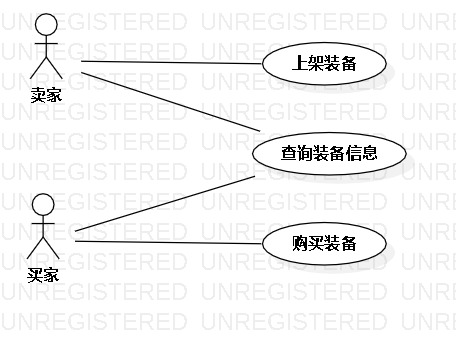

# 实验二：用例建模
## 1.实验目标
1. 学会使用Markdown编写实验报告
2. 学会使用StarUML绘制用例图
3. 学会编写用例规约

## 2.实验内容
1. 细化功能需求。
2. 画出用例图（Use Case Diagram）。
3. 编写用例规约（表格）

## 3.实验步骤
1. 细化系统功能
录入装备：录入新的装备
查询装备：根据装备名查询装备信息
修改装备信息：更新已有的装备信息
2. 确定参与者：买家，卖家
3. 添加用例：卖家上架装备，用户查询装备，买家购买装备
4. 建立参与者与用例之间的联系
5. 绘制用例图
6. 编写用例规约

## 4.实验结果

图1：配装模拟器的用例图
## 表1：上架装备的用例1规约  

用例编号  | UC01 | 备注  
-|:-|-  
用例名称  | 上架装备  |   
前置条件  |   卖家登录   | *可选*   
后置条件  |      | *可选*   
基本流程  | 1.卖家点击上架按钮  |*用例执行成功的步骤*    
~| 2. 系统显示上架界面 |   
~| 3. 卖家输入装备信息，输入后点击确定按钮 |   
~| 4. 系统保存装备信息  |   
~| 5. 系统提示“上架成功”，返回首页  |   
扩展流程  | 3.1 系统检查装备信息，提示“请输入完整的装备信息” |

## 表2:查询装备的用例2规约  

用例编号  | UC02 | 备注  
-|:-|-  
用例名称  |   查询装备   |   
前置条件  |   用户（买家或卖家）登录   | *可选*   
后置条件  |      | *可选*   
基本流程  | 1.用户点击查找按钮  |*用例执行成功的步骤*    
~| 2. 系统显示查询界面 |   
~| 3. 用户输入装备名称，点击查询按钮 | 
~| 4. 系统检查装备已上架，系统查询装备信息 |     
~| 5. 系统显示装备信息  |   
扩展流程  | 4.1 系统检查装备名称为空，提示“请输入装备名称” |
~| 4.2 检查装备未上架，提示“未上架此装备” |   

## 表3：购买装备的用例3规约  

用例编号  | UC03 | 备注  
-|:-|-  
用例名称  |   购买装备   |   
前置条件  |   买家查询装备   | *可选*   
后置条件  |      | *可选*   
基本流程  | 1.卖家点击购买按钮  |*用例执行成功的步骤*      
~| 2. 系统检查装备库存不为0 |   
~| 3. 系统显示订单信息 |   
~| 4. 买家点击确定按钮 |  
~| 5. 系统提示“下单成功”,返回首页  |   
扩展流程  | 2.1 系统检查装备存库为0，提示“装备已售罄” |
