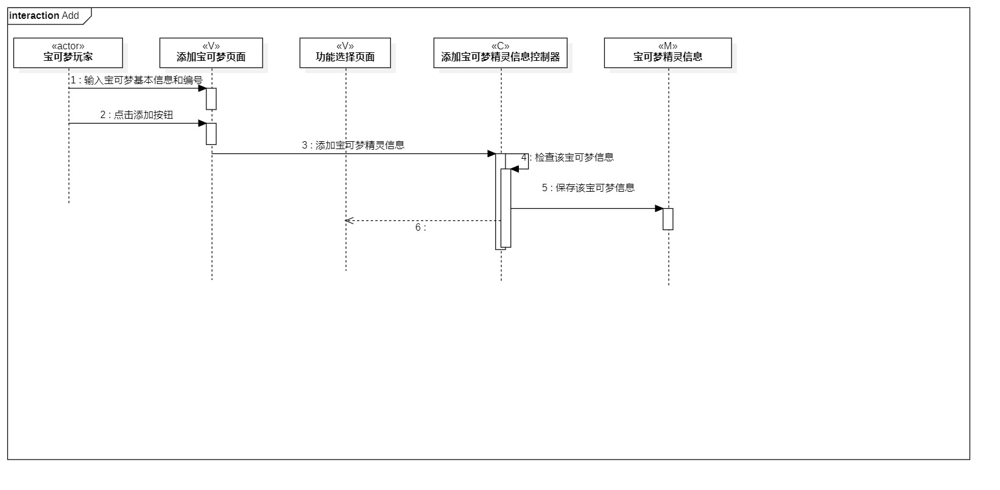
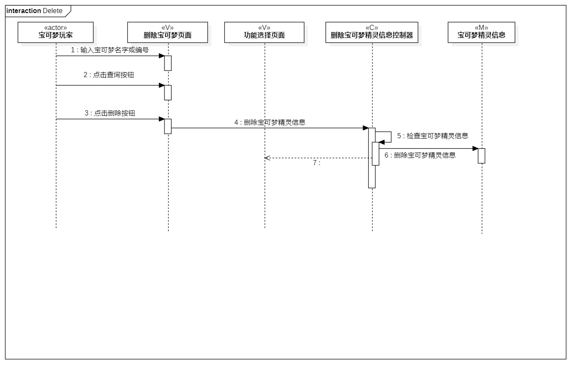

# 实验六

## 一、实验目标

1. 理解系统交互
2. 掌握UML顺序图的画法
3. 理解对象交互的定义与建模方法

## 二、实验内容

1. 观看教学视频，学习交互建模知识
2. 根据用例模型和类模型，确定功能所涉及的系统对象
3. 在顺序图上画出参与者（对象）
4. 在顺序图上画出消息（交互）

## 三、实验步骤

1. 使用哔哩哔哩网站，观看和学习交互建模知识
2. 根据用例模型和类模型，确定功能所涉及的系统对象
3. 根据 添加宝可梦精灵信息 的用例规约设计：
	- 参与者(actor)：宝可梦玩家
	- M：宝可梦精灵信息
	- V：功能选择页面 添加宝可梦页面
	- C：添加宝可梦精灵信息控制器
	- 消息(message)：添加宝可梦信息-用例规约里的步骤
4. 根据 删除宝可梦精灵信息 的用例规约设计：
	- 参与者(actor)：宝可梦玩家
	- M：宝可梦精灵信息
	- V：功能选择页面 删除宝可梦页面
	- C：删除宝可梦精灵信息控制器
	- 消息(message)：删除宝可梦信息-用例规约里的步骤

## 四、实验结果
1. 顺序活动图

  
图1. 添加宝可梦精灵信息的顺序活动图  

  
图2. 删除宝可梦精灵信息的顺序活动图 
