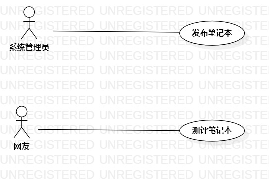

# 实验2 用例建模
## 实验目标
1. 使用Markdown编写报告
2. 细化选题
3. 学习使用StarUML用例建模
## 实验内容
1. 创建用例图
2. 编写实验报告文档
3. 编写用例规约
## 实验步骤
1、选题并提出用例  
2、1.确定发布笔记本用例  
&emsp;&ensp;2.确定参与者系统管理员  
&emsp;&ensp;3.建立联系  
3、1.确定测评笔记本用例  
&emsp;&ensp;2.确定参与者网友  
&emsp;&ensp;3.建立联系  
4、编写用例规约  
## 实验结果
画图

UML用例图

# 用例规约

## 表1：发布笔记本用例规约

用例编号  | UC01 | 备注  
-|:-|-  
用例名称  | 录入笔记本  |   
前置条件  |   管理员已登录   | *可选*   
后置条件  |   发布笔记本   | *可选*   
基本流程  | 1. 管理员点击发布笔记本  |*用例执行成功的步骤*    
~| 2. 系统显示发布页面  |   
~| 3. 管理员输入笔记本基本信息，点击发布按钮  |   
~| 4. 系统检查没有相同笔记本，系统保存数据，增加新的评测页面   |   
~| 5. 系统显示发布成功，退回管理页面   |  
扩展流程  | 4.1系统检查发现有相同笔记本已发布   |*用例执行失败*    

用例编号  | UC02 | 备注  
-|:-|-  
用例名称  | 测评笔记本  |   
前置条件  |   网友已登录   | *可选*   
后置条件  |   发布评测   | *可选*   
基本流程  | 1. 网友点击我要评测  |*用例执行成功的步骤*    
~| 2. 系统显示评测页面  |   
~| 3. 网友输入评测内容，上传笔记本图片，点击发布评测   |   
~| 4. 系统检查评测内容无误，检测已上传图片，系统保存评测，发表测评 |   
~| 5. 显示最新评测页面   |  
扩展流程  |4.1 无评测内容或内容过少   |*用例执行失败*    
~| 4.2 评测内容包含过多敏感词汇   |  
~| 4.3 未上传笔记本图片   |  
