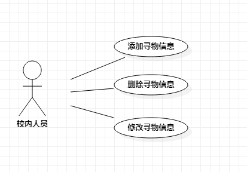

# 实验二：用例建模

## 一、实验目标

1. 熟悉Markdown的各种语法
2. 完成大作业选题
3. 编写好实验二报告文档

## 二、实验内容

1. 描述系统的功能
2. 在StarUML上画一个关于自己系统的用例图
3. 编写关于自己系统的用例规约

## 三、实验步骤

1. 决定命题：校园寻物启事系统
2. 使用校园寻物启事系统的用户：  
   校内人员
3. 校园寻物启事系统功能：  
   3.1 发布寻物信息：    
       校内人员可以在系统上发布自己的寻物信息  
   3.2 删除寻物信息：  
       校内人员可以在系统上删除自己发布的寻物信息  
   3.3 修改寻物信息：  
       校内人员可以在系统上修改自己发布的寻物信息
4. 画一个有关自己系统的示例图
    4.1 用ACTOR创建用户和管理员  
    4.2 再用椭圆创建三个功能  
    4.3 最后用线将他们连接在一起
5. 编写命题的用例规约

## 四、实验结果

1. 画图

  
图2. 校园寻物启事系统用例图

## 表1：发布用例规约  

用例编号  | zjf01 | 备注  
-|:-|-  
用例名称  | 发布  |   
前置条件  |  校内人员登录系统    | *可选*   
后置条件  |      | *可选*   
基本流程  | 1.校内人员点击发布按钮；  |*用例执行成功的步骤*    
~| 2. 系统显示发布寻物信息页面；  |   
~| 3. 校内人员输入寻物信息，点击确定按钮；   |   
~| 4. 系统检查输入的寻物信息是否规范；  |   
~| 5. 系统保存新发布的寻物信息，提示“发布成功”；  |  
扩展流程  | 4.1 系统检查发现输入的寻物信息不符合规范，提示“输入不正确”   |*用例执行失败*    
~|    | 

## 表2：删除用例规约

用例编号  | zjf02 | 备注  
-|:-|-  
用例名称  | 删除  |   
前置条件  |  校内人员登录系统    | *可选*   
后置条件  |  校内人员进入已发布信息页面    | *可选*   
基本流程  | 1.校内人员进入目标信息页面；  |*用例执行成功的步骤*    
~| 2. 校内人员点击删除按钮；  |   
~| 3. 系统检查信息编号是否存在；   |   
~| 4. 系统显示已发布信息页面；  |   
~| 5.   |  
扩展流程  | 3.1 系统检查发现寻物信息不存在，提示“该信息不存在”   |*用例执行失败*    
~| 4.1 系统显示目标信息页面   | 

## 表3：修改用例规约

用例编号  | zjf03 | 备注  
-|:-|-  
用例名称  | 修改  |   
前置条件  |  校内人员登录系统    | *可选*   
后置条件  |   校内人员进入已发布信息页面   | *可选*   
基本流程  | 1. 校内人员进入目标信息页面；  |*用例执行成功的步骤*    
~| 2. 校内人员输入修改信息，点击修改按钮；  |   
~| 3. 系统检查修改的信息是否符合规范；   |   
~| 4. 系统保存修改的寻物信息，提示“修改成功”；  |   
~| 5.   |  
扩展流程  | 3.1 系统检查发现修改的信息不符合规范，提示“修改失败”  |*用例执行失败*    
~| 4.1 系统显示目标信息页面   | 

