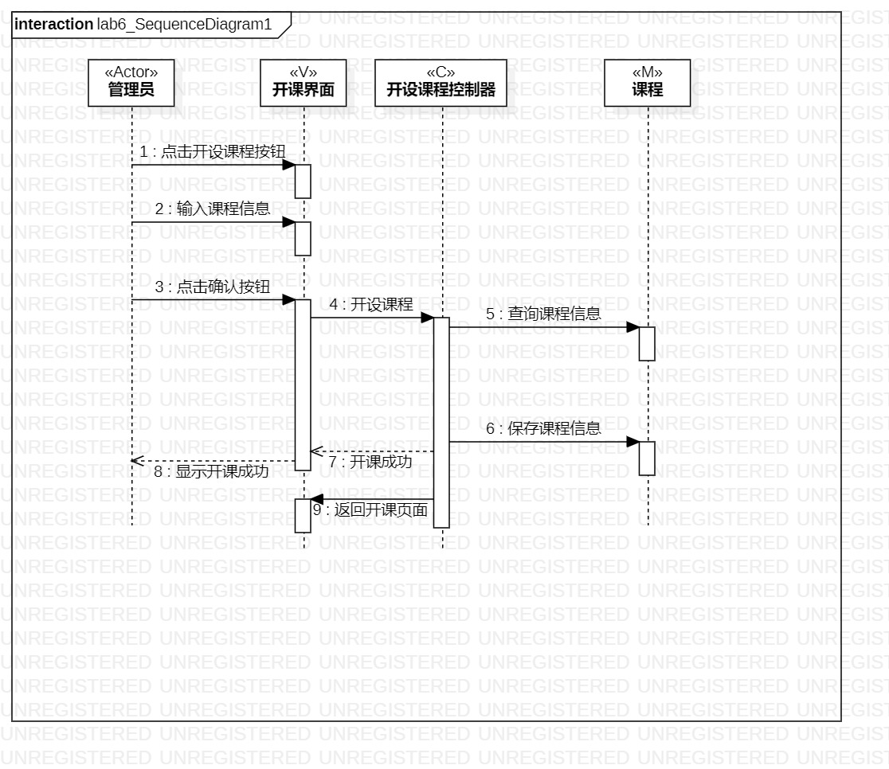
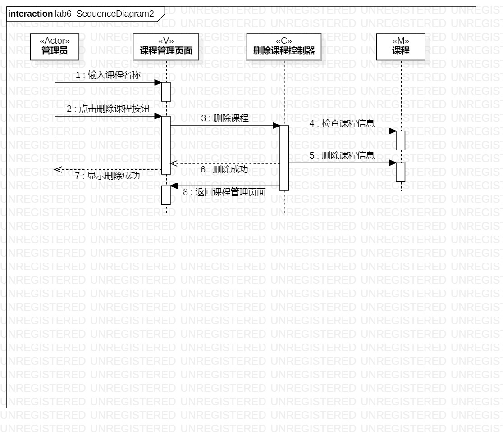

# 实验六：交互建模  

## 一.实验目标  
1.理解系统交互  
2.掌握UML顺序图的画法  
3.掌握对象交互的定义与建模方法  

## 二.实验内容  
1.根据用例模型和类模型，确定功能所涉及的系统对象  
2.在顺序图上画出参与者（对象）   
3.在顺序图上画出消息（交互）  

## 三.实验步骤  
1.观看实验六相关视频  
2.根据视频提示对实验四实验五的类模型进行修改  
3.创建增加课程的顺序图  
4.根据用例规约、用例图和类图，找出1+N个参与者  
5.根据活动图提炼操作流程，在顺序图中画出参与者之间的消息  
6.审查用例规约确认交互流程匹配  
7.创建删除课程的顺序图  
8.根据用例规约、用例图和类图，找出1+N个参与者  
9.根据活动图提炼操作流程，在顺序图中画出参与者之间的消息  
10.审查用例规约确认交互流程匹配  

## 四.实验结果  
  
图1：开设课程顺序图  

  
图2：删除课程顺序图   

## 五.课堂笔记  
1.顺序图：  
- 参与者  
- 时间（描述了交互发生的顺序）  
- 时间顺序-从上到下，仅表示先后顺序，不表示时间跨度  
- 事件=信号=消息  
- 存活条（显示了发送端和接收端）  
- 消息箭头（同步，异步，返回）  

2.从用例图找到第1个参与者，从类图找到N个参与者，总共1+N个参与者  
3.从活动图找到操作步骤，画出参与者之间的关系  
